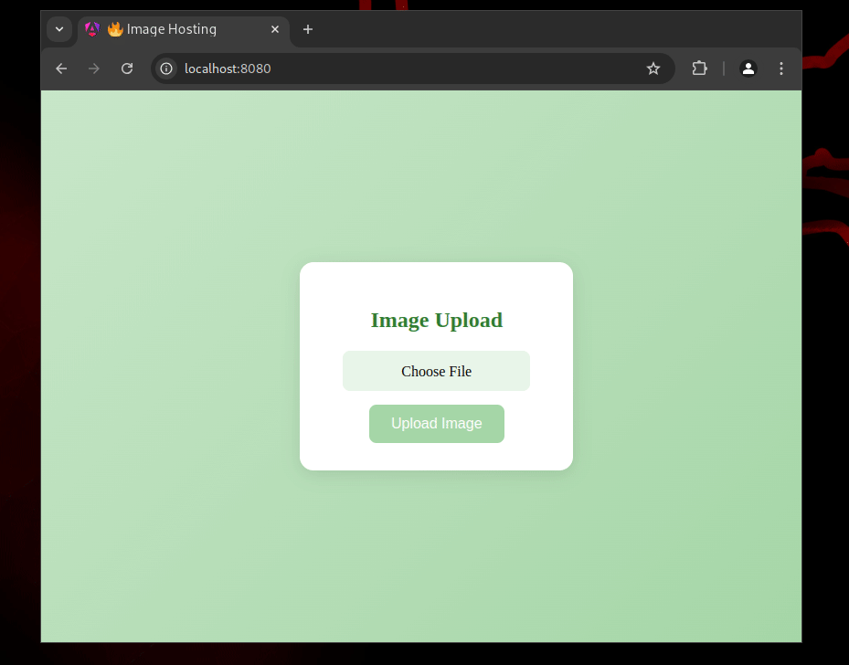

# ImageHosting

An elegant image hosting website with just the features you need: Upload and view the images!

*Built with Angular and uses Firebase to store the images.*



## Deployment

Configure Firebase storage with proper rules like
```
service firebase.storage {
  match /b/{bucket}/o {
    match /images/{name} {
      allow create: if resource == null
                         && request.resource.size < 2 * 1024 * 1024
                         && name.matches('.*\\.(png|jpg|jpeg)$');
      allow read: if true;
      allow update, delete: if false;
    }
  }
}
```

Put the credentials in src/environments/environment.ts

And finally run `ng build` and host the built files.
